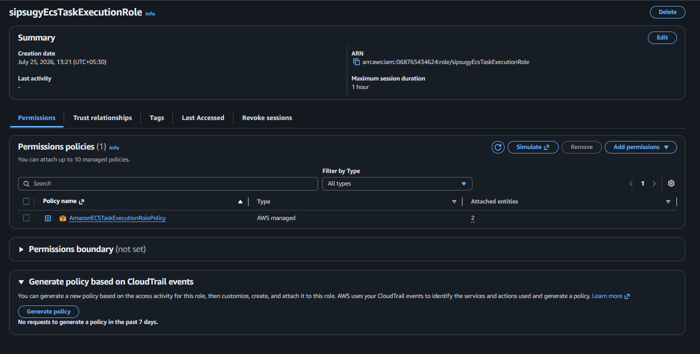
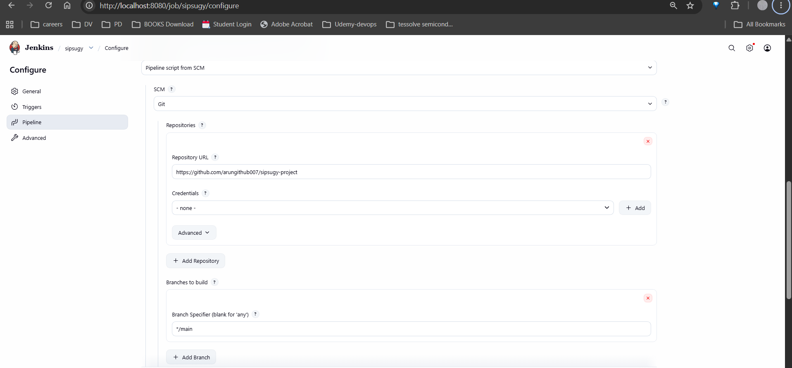
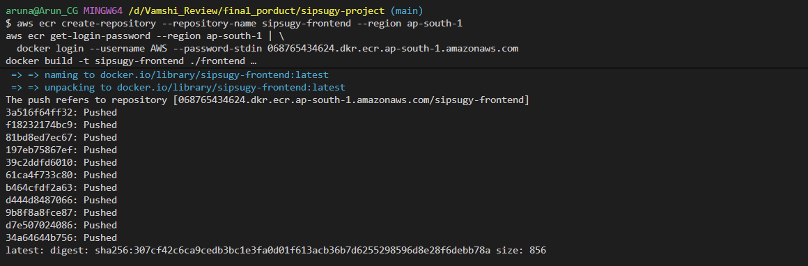
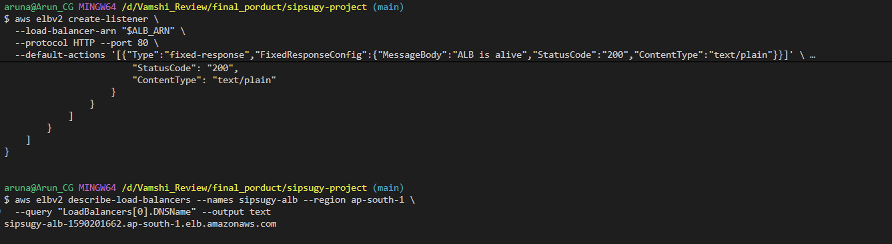

# SipSugy — 3-Tier AWS DevOps Project

Fresh sugarcane juice, ordered online. Deployed as a 3-tier app on AWS.

## Status

| Tier              | Stack                       | Local (Docker Compose) | AWS                              |
|-------------------|------------------------------|-------------------------|-----------------------------------|
| Frontend + proxy  | React (Vite) → Nginx         | ✅                       | ✅ ECS Fargate + ALB               |
| Backend           | Node.js (Express)             | ✅                       | ✅ ECS Fargate (Service Connect)   |
| Database          | MySQL 8                       | ✅ (container)           | ✅ Amazon RDS for MySQL            |
| CI/CD             | Jenkins (local, Docker)       | —                        | ✅ builds/pushes/deploys all three |

AWS account: `068765434624`  ·  Region: `ap-south-1`

## Run everything locally

```bash
cp db/.env.example .env
docker compose up --build
```
- Frontend (proxied through Nginx): http://localhost:8080
- Backend API directly: http://localhost:4000/api/health
- MySQL: localhost:3306

## Run in AWS — overview

- **ECS cluster** `sipsugy-cluster` (Fargate, Service Connect namespace `sipsugy.local`)
- **Frontend service** `sipsugy-frontend-svc` — public, behind ALB `sipsugy-alb`
- **Backend service** `sipsugy-backend-svc` — private, reachable only as
  `backend:4000` from other services in the namespace (matches
  `frontend/nginx.conf`'s `proxy_pass` unchanged)
- **Database**: Amazon RDS for MySQL (`sipsugy-db`), private subnet, only
  reachable from the ECS tasks' security group. Master password is managed
  by RDS in Secrets Manager — never stored in plaintext anywhere in this
  repo or in Jenkins.
- **CI/CD**: Jenkins running locally in Docker Desktop (`jenkins/Dockerfile`),
  pipeline defined in `Jenkinsfile` — tests both tiers, builds all images,
  pushes to ECR, and force-redeploys both ECS services on every run.

Full step-by-step instructions for both a CLI and a GUI-only deployment are
below (also available as standalone files: `deployment-runbook-cli.md` and
`deployment-guide-gui.md`).

---

## Deploying to AWS — step by step (CLI, Git Bash)

These commands assume **Git Bash** (the terminal VS Code opens by default
on Windows when Git for Windows is installed), not PowerShell or cmd.

> **Two Git-Bash-on-Windows quirks to know about up front:**
> 1. Git Bash (MSYS) rewrites arguments that look like absolute Unix paths
>    (e.g. `/var/run/docker.sock`) into Windows paths before handing them
>    to Docker — which breaks container bind mounts. Fix: prefix the
>    command with `MSYS_NO_PATHCONV=1`. Every command below that needs it
>    already has it.
> 2. Reading a password out of a Secrets Manager JSON response needs `jq`,
>    which Git Bash doesn't ship with. Install it once with
>    `winget install jqlang.jq` and restart your terminal.

### Stage 0 — Foundation

**Install local tools** (any shell — these are Windows-level installs):
```bash
winget install --id Git.Git -e --source winget
winget install --id Docker.DockerDesktop -e --source winget
winget install --id Amazon.AWSCLI -e --source winget
winget install jqlang.jq
```
Restart your laptop after Docker Desktop installs (needs WSL2). Then, in
Git Bash, verify:
```bash
git --version
docker --version
aws --version
jq --version
```

**Push the code to GitHub.** Create an empty repo first at
https://github.com/new (e.g. `sipsugy-3tier`, no README — you already have
files), then:
```bash
git config --global user.name "Arun"
git config --global user.email "you@example.com"

cd /c/path/to/aws-devops-project
git init
git add .
git commit -m "Initial commit: 3-tier SipSugy app"
git branch -M main
git remote add origin https://github.com/<your-username>/sipsugy-3tier.git
git push -u origin main
```

**Configure the AWS CLI:**
```bash
aws configure
# Access Key ID / Secret Access Key: <your credentials>
# Default region: ap-south-1
# Default output: json

aws sts get-caller-identity   # confirm Account = 068765434624
```


**IAM: task execution role + Jenkins deploy user:**
```bash
aws iam create-role --role-name sipsugyEcsTaskExecutionRole \
  --assume-role-policy-document file://iam/ecs-task-trust-policy.json

aws iam attach-role-policy --role-name sipsugyEcsTaskExecutionRole \
  --policy-arn arn:aws:iam::aws:policy/service-role/AmazonECSTaskExecutionRolePolicy
```



```
aws iam create-user --user-name jenkins-ecs-deployer

aws iam put-user-policy --user-name jenkins-ecs-deployer \
  --policy-name SipSugyDeployPolicy \
  --policy-document file://iam/jenkins-deploy-policy.json

aws iam create-access-key --user-name jenkins-ecs-deployer
# Save the AccessKeyId + SecretAccessKey shown — only shown once.
```


**ECS cluster with Service Connect enabled:**
```bash
aws ecs create-cluster --cluster-name sipsugy-cluster \
  --service-connect-defaults namespace=sipsugy.local \
  --region ap-south-1
```


**Networking — default VPC + security groups:**
```bash
VPC_ID=$(aws ec2 describe-vpcs --filters "Name=isDefault,Values=true" \
  --query "Vpcs[0].VpcId" --output text --region ap-south-1)

SUBNETS=$(aws ec2 describe-subnets --filters "Name=vpc-id,Values=$VPC_ID" \
  --query "Subnets[].SubnetId" --output text --region ap-south-1)
SUBNET_LIST=$(echo $SUBNETS | tr ' ' ',')

ALB_SG=$(aws ec2 create-security-group --group-name sipsugy-alb-sg \
  --description "SipSugy ALB" --vpc-id "$VPC_ID" --region ap-south-1 \
  --query "GroupId" --output text)
aws ec2 authorize-security-group-ingress --group-id "$ALB_SG" \
  --protocol tcp --port 80 --cidr 0.0.0.0/0 --region ap-south-1
```


```bash
ECS_SG=$(aws ec2 create-security-group --group-name sipsugy-ecs-sg \
  --description "SipSugy ECS tasks" --vpc-id "$VPC_ID" --region ap-south-1 \
  --query "GroupId" --output text)
aws ec2 authorize-security-group-ingress --group-id "$ECS_SG" \
  --protocol tcp --port 80 --source-group "$ALB_SG" --region ap-south-1
aws ec2 authorize-security-group-ingress --group-id "$ECS_SG" \
  --protocol tcp --port 4000 --source-group "$ECS_SG" --region ap-south-1
```

*(Using the default VPC's public subnets avoids needing a NAT gateway —
Fargate tasks get a public IP to reach ECR. Private subnets + NAT is a
hardening step for later.)*

**Jenkins, running locally in Docker Desktop:**
```bash
cd /c/path/to/aws-devops-project
docker build -t sipsugy-jenkins ./jenkins
docker volume create jenkins_home

MSYS_NO_PATHCONV=1 docker run -d --name jenkins \
  -p 8080:8080 -p 50000:50000 \
  -v jenkins_home:/var/jenkins_home \
  -v /var/run/docker.sock:/var/run/docker.sock \
  sipsugy-jenkins

MSYS_NO_PATHCONV=1 docker exec jenkins cat /var/jenkins_home/secrets/initialAdminPassword
```
Open http://localhost:8080, unlock, install suggested plugins + **Docker
Pipeline**. Add two credentials (Manage Jenkins → Credentials → System →
Global), kind **Secret text**: `AWS_ACCESS_KEY_ID`, `AWS_SECRET_ACCESS_KEY`
(from the IAM step above). Create a Pipeline job named `sipsugy` →
Pipeline script from SCM → Git → your repo URL → branch `main` → script
path `Jenkinsfile`.



### Stage 1 — Frontend (ECR, ALB, ECS)

```bash
# ECR repo + first manual push
aws ecr create-repository --repository-name sipsugy-frontend --region ap-south-1
aws ecr get-login-password --region ap-south-1 | \
  docker login --username AWS --password-stdin 068765434624.dkr.ecr.ap-south-1.amazonaws.com
docker build -t sipsugy-frontend ./frontend
docker tag sipsugy-frontend:latest 068765434624.dkr.ecr.ap-south-1.amazonaws.com/sipsugy-frontend:latest
docker push 068765434624.dkr.ecr.ap-south-1.amazonaws.com/sipsugy-frontend:latest

# Log group
aws logs create-log-group --log-group-name ecs/sipsugy-frontend --region ap-south-1
#to check the log groups we created
 aws logs describe-log-groups --region ap-south-1 \
  --query "logGroups[*].logGroupName" --output table
```


```bash
# ALB + target group + listener
ALB_ARN=$(aws elbv2 create-load-balancer --name sipsugy-alb \
  --subnets $SUBNETS --security-groups "$ALB_SG" \
  --scheme internet-facing --type application --region ap-south-1 \
  --query "LoadBalancers[0].LoadBalancerArn" --output text)

TG_ARN=$(aws elbv2 create-target-group --name sipsugy-frontend-tg \
  --protocol HTTP --port 80 --vpc-id "$VPC_ID" --target-type ip \
  --health-check-path / --region ap-south-1 \
  --query "TargetGroups[0].TargetGroupArn" --output text)
#or
TG_ARN=$(MSYS_NO_PATHCONV=1 aws elbv2 create-target-group --name sipsugy-frontend-tg \
  --protocol HTTP --port 80 --vpc-id "$VPC_ID" --target-type ip \
  --health-check-path "/" --region ap-south-1 \
  --query "TargetGroups[0].TargetGroupArn" --output text)

aws elbv2 create-listener --load-balancer-arn "$ALB_ARN" \
  --protocol HTTP --port 80 \
  --default-actions Type=forward,TargetGroupArn=$TG_ARN --region ap-south-1
#or
aws elbv2 create-listener \
  --load-balancer-arn "$ALB_ARN" \
  --protocol HTTP --port 80 \
  --default-actions '[{"Type":"fixed-response","FixedResponseConfig":{"MessageBody":"ALB is alive","StatusCode":"200","ContentType":"text/plain"}}]' \
  --region ap-south-1


aws elbv2 describe-load-balancers --names sipsugy-alb --region ap-south-1 \
  --query "LoadBalancers[0].DNSName" --output text
# ^ this is your public URL
```


Edit `ecs/frontend-task-def.json`: replace `IMAGE_PLACEHOLDER` with
`068765434624.dkr.ecr.ap-south-1.amazonaws.com/sipsugy-frontend:latest`
(revert it afterward — Jenkins owns real tags from here on), also check `awslogs-group` replace it with `log group` we created. then:
```bash
aws ecs register-task-definition --cli-input-json file://ecs/frontend-task-def.json --region ap-south-1

aws ecs create-service --cluster sipsugy-cluster \
  --service-name sipsugy-frontend-svc \
  --task-definition sipsugy-frontend \
  --desired-count 1 --launch-type FARGATE \
  --network-configuration "awsvpcConfiguration={subnets=[$SUBNET_LIST],securityGroups=[$ECS_SG],assignPublicIp=ENABLED}" \
  --load-balancers "targetGroupArn=$TG_ARN,containerName=frontend,containerPort=80" \
  --service-connect-configuration "enabled=true,namespace=sipsugy.local" \
  --region ap-south-1
```
Verify with `aws ecs describe-services --cluster sipsugy-cluster --services sipsugy-frontend-svc --region ap-south-1` (look for `running: 1`), then open the ALB DNS name in a browser.

Commit and trigger Jenkins:
```bash
git add Jenkinsfile ecs iam jenkins .gitignore
git commit -m "Add ECS/IAM/Jenkins deployment files"
git push
```
Click **Build Now** in Jenkins.

### Stage 2 — Backend (ECR, ECS, Service Connect)

```bash
aws ecr create-repository --repository-name sipsugy-backend --region ap-south-1
aws ecr get-login-password --region ap-south-1 | \
  docker login --username AWS --password-stdin 068765434624.dkr.ecr.ap-south-1.amazonaws.com
docker build -t sipsugy-backend ./backend
docker tag sipsugy-backend:latest 068765434624.dkr.ecr.ap-south-1.amazonaws.com/sipsugy-backend:latest
docker push 068765434624.dkr.ecr.ap-south-1.amazonaws.com/sipsugy-backend:latest

aws logs create-log-group --log-group-name /ecs/sipsugy-backend --region ap-south-1
```
Edit `ecs/backend-task-def.json`: replace `IMAGE_PLACEHOLDER` the same way
(leave `DB_HOST_PLACEHOLDER` / `DB_SECRET_ARN_PLACEHOLDER` for Stage 3), then:
```bash
aws ecs register-task-definition --cli-input-json file://ecs/backend-task-def.json --region ap-south-1

# No ALB — reached only via Service Connect as "backend:4000"
aws ecs create-service --cluster sipsugy-cluster \
  --service-name sipsugy-backend-svc \
  --task-definition sipsugy-backend \
  --desired-count 1 --launch-type FARGATE \
  --network-configuration "awsvpcConfiguration={subnets=[$SUBNET_LIST],securityGroups=[$ECS_SG],assignPublicIp=ENABLED}" \
  --service-connect-configuration file://ecs/backend-service-connect.json \
  --region ap-south-1

# Nudge frontend to pick up the new alias
aws ecs update-service --cluster sipsugy-cluster --service sipsugy-frontend-svc \
  --force-new-deployment --region ap-south-1
```
Reload the site and place a test order — confirmation should say **"Order
sent"**, not "Saved on this device." Still in-memory storage until Stage 3.
```bash
git add Jenkinsfile ecs
git commit -m "Add backend ECS deployment (Service Connect)"
git push
```
Click **Build Now** in Jenkins.

### Stage 3 — Database (Amazon RDS for MySQL)

```bash
aws rds create-db-subnet-group --db-subnet-group-name sipsugy-db-subnet-group \
  --db-subnet-group-description "SipSugy RDS subnets" \
  --subnet-ids $SUBNETS --region ap-south-1

DB_SG=$(aws ec2 create-security-group --group-name sipsugy-db-sg \
  --description "SipSugy RDS" --vpc-id "$VPC_ID" --region ap-south-1 \
  --query "GroupId" --output text)
aws ec2 authorize-security-group-ingress --group-id "$DB_SG" \
  --protocol tcp --port 3306 --source-group "$ECS_SG" --region ap-south-1

aws rds create-db-instance \
  --db-instance-identifier sipsugy-db \
  --db-instance-class db.t3.micro \
  --engine mysql \
  --allocated-storage 20 \
  --master-username admin \
  --manage-master-user-password \
  --db-name sipsugy \
  --vpc-security-group-ids "$DB_SG" \
  --db-subnet-group-name sipsugy-db-subnet-group \
  --backup-retention-period 7 \
  --no-publicly-accessible \
  --region ap-south-1

aws rds wait db-instance-available --db-instance-identifier sipsugy-db --region ap-south-1

DB_ENDPOINT=$(aws rds describe-db-instances --db-instance-identifier sipsugy-db \
  --query "DBInstances[0].Endpoint.Address" --output text --region ap-south-1)
DB_SECRET_ARN=$(aws rds describe-db-instances --db-instance-identifier sipsugy-db \
  --query "DBInstances[0].MasterUserSecret.SecretArn" --output text --region ap-south-1)
```
**Load the schema** — briefly open access, run it, then lock back down:
```bash
MY_IP=$(curl -s https://checkip.amazonaws.com)
aws ec2 authorize-security-group-ingress --group-id "$DB_SG" \
  --protocol tcp --port 3306 --cidr "$MY_IP/32" --region ap-south-1
aws rds modify-db-instance --db-instance-identifier sipsugy-db \
  --publicly-accessible --apply-immediately --region ap-south-1
aws rds wait db-instance-available --db-instance-identifier sipsugy-db --region ap-south-1

DB_PASSWORD=$(aws secretsmanager get-secret-value --secret-id "$DB_SECRET_ARN" \
  --query SecretString --output text --region ap-south-1 | jq -r .password)

cat db/init.sql | docker run -i --rm mysql:8.0 \
  mysql -h "$DB_ENDPOINT" -u admin -p"$DB_PASSWORD" sipsugy

aws rds modify-db-instance --db-instance-identifier sipsugy-db \
  --no-publicly-accessible --apply-immediately --region ap-south-1
aws ec2 revoke-security-group-ingress --group-id "$DB_SG" \
  --protocol tcp --port 3306 --cidr "$MY_IP/32" --region ap-south-1
```
**Let the task execution role read the secret:**
```bash
sed -i "s|DB_SECRET_ARN_PLACEHOLDER|$DB_SECRET_ARN|g" iam/ecs-secrets-policy.json
aws iam put-role-policy --role-name sipsugyEcsTaskExecutionRole \
  --policy-name SipSugyReadDbSecret --policy-document file://iam/ecs-secrets-policy.json
```
**Point the backend at RDS and redeploy:**
```bash
sed -i "s|DB_HOST_PLACEHOLDER|$DB_ENDPOINT|g; s|DB_SECRET_ARN_PLACEHOLDER|$DB_SECRET_ARN|g" \
  ecs/backend-task-def.json

aws ecs register-task-definition --cli-input-json file://ecs/backend-task-def.json --region ap-south-1
aws ecs update-service --cluster sipsugy-cluster --service sipsugy-backend-svc \
  --task-definition sipsugy-backend --force-new-deployment --region ap-south-1
```
Verify: `aws logs tail /ecs/sipsugy-backend --since 5m --region ap-south-1`
should show `Connected to MySQL.`. Place an order, restart the backend
task, reload — the order should still be there.
```bash
git add ecs/backend-task-def.json iam/ecs-secrets-policy.json README.md
git commit -m "Wire backend to RDS for MySQL"
git push
```
Click **Build Now** in Jenkins — no Jenkinsfile changes needed; `DB_HOST`
and the secret ARN are one-time values already baked into the task
definition file.

### Cost & cleanup
- `db.t3.micro` ≈ $12–13/month if left running; Multi-AZ roughly doubles
  that (add `--multi-az` to `create-db-instance` if you want it).
- To tear down: delete the ECS services, then the cluster, then
  `aws rds delete-db-instance --db-instance-identifier sipsugy-db --skip-final-snapshot`,
  then the ALB, target group, security groups, and ECR repos.

---

## Deploying to AWS — step by step (GUI / point-and-click)

The same deployment via the AWS Console, GitHub Desktop, and the Jenkins
web UI — no terminal, with **one honest exception**: Docker Desktop's
dashboard can run a container from an existing image, but it can't build
a custom image from a Dockerfile, and there's no GUI for mounting the
Docker socket. Since Jenkins needs the Docker CLI + AWS CLI baked in
(`jenkins/Dockerfile`) to do its job, getting Jenkins started is the one
place this still uses four terminal commands (below). Everything else is
clicking.

### Part A — Install local tools (installer wizards, no terminal)
- Git for Windows: https://git-scm.com/download/win
- GitHub Desktop: https://desktop.github.com
- Docker Desktop: https://www.docker.com/products/docker-desktop
- AWS CLI v2: https://awscli.amazonaws.com/AWSCLIV2.msi
- MySQL Workbench (for loading the schema in Part G): https://dev.mysql.com/downloads/workbench/

Restart after Docker Desktop installs.

### Part B — Push the code with GitHub Desktop
1. Create an empty repo at https://github.com/new.
2. Open **GitHub Desktop** → sign in.
3. **File → Add local repository** → browse to the project folder → if
   prompted, click **create a repository**.
4. Write a commit summary → **Commit to main**.
5. **Publish repository** (top bar) → choose public/private → **Publish**.

From then on: Changes tab → summary → **Commit to main** → **Push origin**.

### Part C — AWS Console: IAM
**Task execution role:** IAM console → Roles → Create role → Trusted
entity: **AWS service** → Use case: **Elastic Container Service** →
**Elastic Container Service Task** → Next → attach
**AmazonECSTaskExecutionRolePolicy** → Next → name it
`sipsugyEcsTaskExecutionRole` → Create role.

**Jenkins deploy policy + user:** IAM → Policies → Create policy → JSON
tab → paste `iam/jenkins-deploy-policy.json` → Next → name
`SipSugyDeployPolicy` → Create policy. Then IAM → Users → Create user →
`jenkins-ecs-deployer` → Attach policies directly → check
`SipSugyDeployPolicy` → Create user → open it → Security credentials →
Create access key → **Third-party service** → confirm → Create → save
both values (secret is shown once).

### Part D — Get Jenkins running (the one terminal exception)
```bash
cd /c/path/to/aws-devops-project
docker build -t sipsugy-jenkins ./jenkins
docker volume create jenkins_home
MSYS_NO_PATHCONV=1 docker run -d --name jenkins -p 8080:8080 -p 50000:50000 -v jenkins_home:/var/jenkins_home -v /var/run/docker.sock:/var/run/docker.sock sipsugy-jenkins
```
1. Get the unlock code via Docker Desktop's **Containers → jenkins →
   Exec/Terminal** tab: `cat /var/jenkins_home/secrets/initialAdminPassword`.
2. Open http://localhost:8080 → unlock → **Install suggested plugins** →
   then **Manage Jenkins → Plugins → Available** → install **Docker
   Pipeline** → create your admin user.
3. **Manage Jenkins → Credentials → System → Global → Add Credentials**,
   twice, kind **Secret text**: `AWS_ACCESS_KEY_ID`, `AWS_SECRET_ACCESS_KEY`.
4. If your repo is private, add a **Username with password** credential
   (GitHub username + a Personal Access Token with `repo` scope).
5. **New Item** → `sipsugy` → **Pipeline** → OK. Under Pipeline: Definition
   = **Pipeline script from SCM** → Git → your repo URL → credentials (if
   needed) → branch `main` → script path `Jenkinsfile` → Save.
6. No webhook reaches a local Jenkins — click **Build Now** manually, or
   set **Build periodically** to `H/5 * * * *`.

### Part E — AWS Console: Frontend (ECR, ALB, ECS)
- **ECR console → Repositories → Create repository** → Private →
  `sipsugy-frontend` → Create. (Jenkins pushes the actual image.)
- **EC2 → Security Groups → Create**: `sipsugy-alb-sg`, inbound HTTP from
  Anywhere-IPv4. Then `sipsugy-ecs-sg`, inbound: TCP 80 from
  `sipsugy-alb-sg`, TCP 4000 from `sipsugy-ecs-sg` itself.
- **EC2 → Load Balancers → Create → Application Load Balancer**: name
  `sipsugy-alb`, Internet-facing, default VPC, ≥2 AZ subnets, security
  group `sipsugy-alb-sg`. Listener HTTP:80 → **Create target group**
  (inline): IP addresses, `sipsugy-frontend-tg`, HTTP 80, health check
  path `/` → back on the ALB page, select it → Create load balancer. Copy
  the ALB's **DNS name** — that's your public URL.
- **AWS Cloud Map console → Create namespace**: `sipsugy.local`, type
  **API calls only**.
- **ECS console → Clusters → Create cluster**: `sipsugy-cluster`,
  infrastructure **AWS Fargate**; select `sipsugy.local` as default
  namespace if shown (otherwise it's set per-service below).
- **ECS → Task definitions → Create new task definition → JSON tab**:
  paste `ecs/frontend-task-def.json` with `IMAGE_PLACEHOLDER` replaced by
  `068765434624.dkr.ecr.ap-south-1.amazonaws.com/sipsugy-frontend:latest` → Create.
- **Clusters → sipsugy-cluster → Services → Create**: Fargate, task
  definition `sipsugy-frontend`, service name `sipsugy-frontend-svc`,
  desired tasks 1; networking: default VPC subnets, `sipsugy-ecs-sg`,
  Public IP **on**; load balancing: ALB `sipsugy-alb` → listener 80 →
  target group `sipsugy-frontend-tg` → container `frontend:80`; Service
  Connect **on**, namespace `sipsugy.local` → Create. Wait for 1/1
  running, then open the ALB DNS name.

### Part F — AWS Console: Backend (ECS + Service Connect)
- **ECR → Create repository** → `sipsugy-backend`.
- **ECS → Task definitions → Create new task definition → JSON tab**:
  paste `ecs/backend-task-def.json` with `IMAGE_PLACEHOLDER` replaced
  (leave the DB placeholders for Part G) → Create.
- **Clusters → sipsugy-cluster → Services → Create**: task definition
  `sipsugy-backend`, service name `sipsugy-backend-svc`; same networking
  as frontend; load balancing **None**; Service Connect **on**, namespace
  `sipsugy.local`, under **Server** add a service: port name `backend`,
  discovery name `backend`, client alias port `4000` / DNS name `backend`
  → Create.
- Redeploy frontend so it sees the new alias: **Services →
  sipsugy-frontend-svc → Update service → check "Force new deployment" →
  Update**.
- Reload the site, place a test order — should say **"Order sent."**

### Part G — AWS Console: Database (RDS for MySQL)
- **EC2 → Security Groups → Create**: `sipsugy-db-sg`, inbound TCP 3306
  from `sipsugy-ecs-sg`.
- **RDS → Subnet groups → Create DB subnet group**: `sipsugy-db-subnet-group`,
  default VPC, all AZ subnets.
- **RDS → Databases → Create database**: Standard create; Engine MySQL;
  Template Free tier/Dev-Test; identifier `sipsugy-db`; Credentials:
  username `admin`, check **Manage master credentials in AWS Secrets
  Manager**; class `db.t3.micro`; storage 20 GiB; Connectivity: default
  VPC, security group `sipsugy-db-sg` (remove `default`), Public access
  **No**; Additional configuration: initial database name `sipsugy`,
  backup retention 7 days → Create database (~10 min).
- Once **Available**: Connectivity & security tab → copy the **Endpoint**;
  Configuration tab → copy the **Master credentials ARN**.
- **Load the schema with MySQL Workbench:**
  1. Temporarily: EC2 → `sipsugy-db-sg` → Edit inbound rules → Add: TCP
     3306, Source **My IP** → Save. RDS → `sipsugy-db` → Modify →
     Public access **Yes** → Apply immediately.
  2. Secrets Manager console → find the secret → **Retrieve secret
     value** → note username/password.
  3. MySQL Workbench → Connect to Database → host = RDS endpoint, port
     3306, user `admin`, password from step 2.
  4. File → Open SQL Script → `db/init.sql` → click **Execute**.
  5. Revert: RDS → Modify → Public access **No**. EC2 → `sipsugy-db-sg`
     → delete the "My IP" rule.
- **Let the backend read the password:** IAM → Roles →
  `sipsugyEcsTaskExecutionRole` → Add permissions → Create inline policy
  → JSON tab → paste `iam/ecs-secrets-policy.json` with the placeholder
  replaced by the Master credentials ARN → name `SipSugyReadDbSecret` →
  Create policy.
- **Point the backend at RDS:** ECS → Task definitions →
  `sipsugy-backend` → Create new revision → JSON tab → fill in
  `DB_HOST_PLACEHOLDER` (endpoint) and `DB_SECRET_ARN_PLACEHOLDER` (ARN)
  → Create. Then Services → `sipsugy-backend-svc` → Update service →
  task definition **Latest** → check **Force new deployment** → Update.
- Verify: CloudWatch → Log groups → `/ecs/sipsugy-backend` → latest
  stream → look for `Connected to MySQL.`. Place an order, force a new
  deployment again, reload — the order should persist.

### Cost & cleanup (console)
- `db.t3.micro` ≈ $12–13/month running continuously.
- Tear down: ECS (delete services, then cluster) → RDS (Delete, skip
  final snapshot if not needed) → EC2 (delete ALB, target group, security
  groups) → ECR (delete both repositories).

---

## Resource creation sequence

Exactly which stage creates which AWS resource, in order:

| Stage | Resource | Type | Created via |
|---|---|---|---|
| **0 — Foundation** | `sipsugyEcsTaskExecutionRole` | IAM role | `aws iam create-role` + attach `AmazonECSTaskExecutionRolePolicy` |
| | `jenkins-ecs-deployer` | IAM user | `create-user` + `put-user-policy` + `create-access-key` |
| | `sipsugy-cluster` | ECS cluster | `aws ecs create-cluster` |
| | `sipsugy.local` | Cloud Map namespace | auto-created by `--service-connect-defaults` on the cluster |
| | `sipsugy-alb-sg` | Security group | `create-security-group` (80 from anywhere) |
| | `sipsugy-ecs-sg` | Security group | `create-security-group` (80 from ALB-sg, 4000 self-referencing) |
| | `sipsugy-jenkins` + container | Local Docker image/container | `docker build` / `docker run` — not an AWS resource |
| **1 — Frontend** | `sipsugy-frontend` | ECR repository | `aws ecr create-repository` |
| | `/ecs/sipsugy-frontend` | CloudWatch log group | `aws logs create-log-group` |
| | `sipsugy-alb` | Application Load Balancer | `aws elbv2 create-load-balancer` |
| | `sipsugy-frontend-tg` | Target group | `aws elbv2 create-target-group` |
| | listener :80 | ALB listener | `aws elbv2 create-listener` |
| | `sipsugy-frontend` | ECS task definition | `aws ecs register-task-definition` |
| | `sipsugy-frontend-svc` | ECS service | `aws ecs create-service` |
| **2 — Backend** | `sipsugy-backend` | ECR repository | `aws ecr create-repository` |
| | `/ecs/sipsugy-backend` | CloudWatch log group | `aws logs create-log-group` |
| | `sipsugy-backend` | ECS task definition | `aws ecs register-task-definition` |
| | `sipsugy-backend-svc` | ECS service (Service Connect alias `backend`) | `aws ecs create-service` |
| | — | Frontend redeploy | `update-service --force-new-deployment` (no new resource) |
| **3 — Database** | `sipsugy-db-subnet-group` | RDS subnet group | `aws rds create-db-subnet-group` |
| | `sipsugy-db-sg` | Security group | `create-security-group` (3306 from ECS-sg) |
| | `sipsugy-db` | RDS instance | `aws rds create-db-instance` |
| | *(auto)* | Secrets Manager secret | created automatically by `--manage-master-user-password` |
| | `SipSugyReadDbSecret` | IAM inline policy | `aws iam put-role-policy` on the task execution role |
| | `sipsugy-backend` (new revision) | ECS task definition update | `register-task-definition` with `DB_HOST`/secret ARN filled in |

---

## Layout

```
aws-devops-project/
├── frontend/                  React + Vite, Dockerfile, nginx.conf (reverse proxy)
├── backend/                   Node.js + Express API, Dockerfile
├── db/                        MySQL schema (init.sql), Dockerfile — local dev;
│                              production data lives in RDS instead
├── ecs/                       ECS task definitions + Service Connect configs
├── iam/                       IAM trust policy + deploy/secrets policies
├── jenkins/                   Custom Jenkins image (Docker CLI + AWS CLI)
├── docker-compose.yml         runs all three together, locally
├── Jenkinsfile                CI/CD pipeline (real AWS account/region wired in)
├── deployment-runbook-cli.md  this guide's CLI section, standalone
└── deployment-guide-gui.md    this guide's GUI section, standalone
```

## Possible next steps

- Route 53 + ACM for a real domain and HTTPS (currently HTTP-only on the ALB)
- Enable RDS Multi-AZ for high availability (currently single-AZ, for cost)
- Move ECS tasks into private subnets + a NAT gateway (currently public
  subnets with public IPs, for simplicity)
- CloudWatch alarms on ECS/RDS metrics