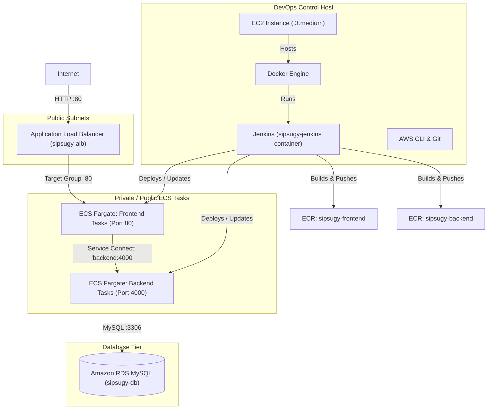

# SipSugy — Complete AWS 3-Tier Deployment Guide (From EC2 Bastion / Build Server)

This guide provides step-by-step instructions to configure an **AWS EC2 instance** as your DevOps control center and build server. From this EC2 instance, you will manage your infrastructure, host your Jenkins CI/CD pipelines in Docker, build and push images to Amazon ECR, deploy your services to ECS Fargate with **Service Connect** and **Application Auto Scaling**, and provision an **Amazon RDS for MySQL** database.

---

## Architecture Overview



### Resource Properties
* **AWS Region:** `ap-south-1` (Mumbai)
* **AWS Account ID:** `068765434624` *(Note: Replace this ID with your actual AWS Account ID if different)*
* **ECS Cluster:** `sipsugy-cluster` (Fargate, namespace: `sipsugy.local`)
* **Frontend Service:** `sipsugy-frontend-svc` (Public, behind ALB `sipsugy-alb`)
* **Backend Service:** `sipsugy-backend-svc` (Private, reached via Service Connect at `backend:4000`)
* **Database:** Amazon RDS for MySQL (`sipsugy-db`), private subnet, port `3306`

---

## Stage 1 — Spin Up and Configure the EC2 Deployment Server

We will launch an EC2 instance that will act as both your command console and your Jenkins build runner.

### 1.1 Launch the EC2 Instance
1. Open the **AWS Console** and navigate to the **EC2 Dashboard**.
2. Click **Launch instance**.
3. Configure the following:
   * **Name:** `sipsugy-devops-server`
   * **Application and OS Image (AMI):** Ubuntu Server 24.04 LTS (HVM), SSD Volume Type (64-bit x86).
   * **Instance Type:** `t3.medium` *(Recommended: 2 vCPUs, 4 GB RAM. Building Node.js/Vite apps and running Docker inside Jenkins will fail on a `t2.micro` due to Out-Of-Memory errors).*
   * **Key Pair:** Create a new key pair or select an existing one (save the `.pem` file).
   * **Network Settings:**
     * Use the **Default VPC**.
     * **Auto-assign public IP:** Enable.
     * **Create security group:** Name it `sipsugy-devops-sg`.
     * **Inbound Security Group Rules:**
       * **SSH** (Port 22) -> Source: `My IP` (for secure administration).
       * **Custom TCP** (Port 8080) -> Source: `Anywhere-IPv4` (to access the Jenkins UI).
   * **Configure Storage:** Change root volume size to **30 GiB** (GP3) to accommodate Docker images and build history.
4. Click **Launch instance**.

### 1.2 Connect to Your EC2 Instance via SSH
Using Git Bash or your local terminal, log in to the instance:
```bash
# Set file permissions on key pair (Linux/macOS/Git Bash)
chmod 400 your-key-pair.pem

# SSH into the Ubuntu instance
ssh -i your-key-pair.pem ubuntu@<EC2-PUBLIC-IP>
```

---

## Stage 2 — Install Required Tools on the EC2 Server

Run these commands inside your EC2 terminal to prepare the host.

### 2.1 Update APT System packages
```bash
sudo apt-get update && sudo apt-get upgrade -y
```

### 2.2 Install Docker Engine
```bash
# Add Docker's official GPG key:
sudo apt-get install -y ca-certificates curl gnupg
sudo install -m 0755 -d /etc/apt/keyrings
curl -fsSL https://download.docker.com/linux/ubuntu/gpg | sudo gpg --dearmor -o /etc/apt/keyrings/docker.gpg
sudo chmod a+r /etc/apt/keyrings/docker.gpg

# Add the repository to Apt sources:
echo \
  "deb [arch=$(dpkg --print-architecture) signed-by=/etc/apt/keyrings/docker.gpg] https://download.docker.com/linux/ubuntu \
  $(. /etc/os-release && echo "$VERSION_CODENAME") stable" | \
  sudo tee /etc/apt/sources.list.d/docker.list > /dev/null

sudo apt-get update
sudo apt-get install -y docker-ce docker-ce-cli containerd.io docker-buildx-plugin docker-compose-plugin

# Enable and start Docker service
sudo systemctl enable docker
sudo systemctl start docker

# Add the 'ubuntu' user to the docker group
sudo usermod -aG docker ubuntu
# Log out and log back in to apply group changes:
exit
```
*Reconnect to the EC2 via SSH after exiting to ensure docker command works without `sudo`:*
```bash
ssh -i your-key-pair.pem ubuntu@<EC2-PUBLIC-IP>
docker --version # Verify it works without sudo
```

### 2.3 Install AWS CLI v2 and JQ
```bash
sudo apt-get install -y unzip jq

# Download and install AWS CLI v2
curl "https://awscli.amazonaws.com/awscli-exe-linux-x86_64.zip" -o "awscliv2.zip"
unzip awscliv2.zip
sudo ./aws/install
rm -rf awscliv2.zip aws

aws --version # Verify installation
```

### 2.4 Clone the Codebase
Clone the project repository directly on your EC2 instance.
```bash
git clone https://github.com/<your-username>/sipsugy-3tier.git
cd sipsugy-3tier
```

---

## Stage 3 — AWS CLI Configuration & IAM Roles

Configure permissions so your EC2 instance and deployment scripts can interact with AWS resources.

### 3.1 Create the IAM Task Execution Role (Allows ECS tasks to download ECR images and write logs)
```bash
# From the project root where iam/ exists:
aws iam create-role --role-name sipsugyEcsTaskExecutionRole \
  --assume-role-policy-document file://iam/ecs-task-trust-policy.json

# Attach the standard Amazon ECS Execution Role policy
aws iam attach-role-policy --role-name sipsugyEcsTaskExecutionRole \
  --policy-arn arn:aws:iam::aws:policy/service-role/AmazonECSTaskExecutionRolePolicy
```

### 3.2 Create the Jenkins Deployer IAM User
This user will generate credentials that Jenkins uses to register ECS task definitions and redeploy services.
```bash
# Create the user
aws iam create-user --user-name jenkins-ecs-deployer

# Put the custom policy for deployments
aws iam put-user-policy --user-name jenkins-ecs-deployer \
  --policy-name SipSugyDeployPolicy \
  --policy-document file://iam/jenkins-deploy-policy.json

# Create credentials (SAVE these credentials immediately!)
aws iam create-access-key --user-name jenkins-ecs-deployer
```
*Record the `AccessKeyId` and `SecretAccessKey` generated. You will configure these inside Jenkins.*

### 3.3 Configure AWS CLI on the EC2 Host
Run the configuration command and input your administrative credentials (or the deployer credentials):
```bash
aws configure
# AWS Access Key ID [None]: <your-access-key-id>
# AWS Secret Access Key [None]: <your-secret-access-key>
# Default region name [None]: ap-south-1
# Default output format [None]: json

# Verify permissions
aws sts get-caller-identity
```

---

## Stage 4 — Spin up Jenkins in Docker on EC2

Now, launch Jenkins inside a Docker container. We bind-mount the host's `/var/run/docker.sock` to enable the Jenkins pipeline to run Docker builds outside the container (Docker-outside-of-Docker).

### 4.1 Build the Custom Jenkins Image
This image contains the Jenkins agent, Docker CLI, and AWS CLI.
```bash
# Navigate to the project root and build the Jenkins image
docker build -t sipsugy-jenkins ./jenkins
```

### 4.2 Run the Jenkins Container
Before launching Jenkins, create a persistent volume and adjust permissions of the Docker socket on the host. This ensures that the non-root containerized Jenkins user (`jenkins` UID 1000) has permission to build images.
```bash
# Allow read-write access to the docker socket for all users on the host
sudo chmod 666 /var/run/docker.sock

# Create a volume for persistent Jenkins configurations
docker volume create jenkins_home

# Start the Jenkins container
docker run -d --name jenkins \
  -p 8080:8080 -p 50000:50000 \
  -v jenkins_home:/var/jenkins_home \
  -v /var/run/docker.sock:/var/run/docker.sock \
  sipsugy-jenkins
```

### 4.3 Configure and Unlock Jenkins
1. Retrieve the administrator password from the container:
   ```bash
   docker exec jenkins cat /var/jenkins_home/secrets/initialAdminPassword
   ```
2. Open your web browser and navigate to `http://<EC2-PUBLIC-IP>:8080`.
3. Paste the administrator password to unlock Jenkins.
4. Click **Install suggested plugins**.
5. Once complete, navigate to **Manage Jenkins** -> **Plugins** -> **Available plugins**.
6. Search for **Docker Pipeline** and install it. Allow Jenkins to restart.
7. Create your Admin user.

### 4.4 Set Up AWS Credentials in Jenkins
1. From the Jenkins homepage, go to **Manage Jenkins** -> **Credentials** -> **System** -> **Global credentials (unrestricted)**.
2. Click **Add Credentials** (Create the following two credentials):
   * **Credential 1:**
     * **Kind:** Secret text
     * **Scope:** Global
     * **ID:** `AWS_ACCESS_KEY_ID`
     * **Secret:** *(The `AccessKeyId` of the `jenkins-ecs-deployer` user created in Step 3.2)*
   * **Credential 2:**
     * **Kind:** Secret text
     * **Scope:** Global
     * **ID:** `AWS_SECRET_ACCESS_KEY`
     * **Secret:** *(The `SecretAccessKey` of the `jenkins-ecs-deployer` user created in Step 3.2)*
3. If your GitHub repository is private, add a third credential:
   * **Kind:** Username with password
   * **ID:** `github-git-creds`
   * **Username:** `<your-github-username>`
   * **Password:** *(A GitHub Personal Access Token with `repo` scope)*

---

## Stage 5 — Networking & Security Infrastructure Setup

Run these commands on the EC2 host to create VPC Security Groups, Load Balancers, and DNS namespaces.

### 5.1 Determine Default VPC and Subnets
```bash
# Get the Default VPC ID
VPC_ID=$(aws ec2 describe-vpcs --filters "Name=isDefault,Values=true" \
  --query "Vpcs[0].VpcId" --output text --region ap-south-1)

# Get the associated subnets
SUBNETS=$(aws ec2 describe-subnets --filters "Name=vpc-id,Values=$VPC_ID" \
  --query "Subnets[].SubnetId" --output text --region ap-south-1)

# Convert subnet space separations to commas for ECS input format
SUBNET_LIST=$(echo $SUBNETS | tr ' ' ',')

echo "VPC ID: $VPC_ID"
echo "Subnets: $SUBNET_LIST"
```

### 5.2 Create Security Groups
1. **ALB Security Group:** Public access on HTTP port 80.
   ```bash
   ALB_SG=$(aws ec2 create-security-group --group-name sipsugy-alb-sg \
     --description "SipSugy ALB Security Group" --vpc-id "$VPC_ID" --region ap-south-1 \
     --query "GroupId" --output text)

   aws ec2 authorize-security-group-ingress --group-id "$ALB_SG" \
     --protocol tcp --port 80 --cidr 0.0.0.0/0 --region ap-south-1
   ```
2. **ECS Tasks Security Group:** Accepts HTTP traffic on port 80 from the ALB, and port 4000 internally for Service Connect.
   ```bash
   ECS_SG=$(aws ec2 create-security-group --group-name sipsugy-ecs-sg \
     --description "SipSugy ECS tasks Security Group" --vpc-id "$VPC_ID" --region ap-south-1 \
     --query "GroupId" --output text)

   # Allow port 80 traffic from the ALB SG
   aws ec2 authorize-security-group-ingress --group-id "$ECS_SG" \
     --protocol tcp --port 80 --source-group "$ALB_SG" --region ap-south-1

   # Allow port 4000 traffic from other ECS tasks sharing this group (for Service Connect)
   aws ec2 authorize-security-group-ingress --group-id "$ECS_SG" \
     --protocol tcp --port 4000 --source-group "$ECS_SG" --region ap-south-1
   ```

### 5.3 Create Application Load Balancer
Create the internet-facing ALB and register the target group.
```bash
# Create ALB
ALB_ARN=$(aws elbv2 create-load-balancer --name sipsugy-alb \
  --subnets $SUBNETS --security-groups "$ALB_SG" \
  --scheme internet-facing --type application --region ap-south-1 \
  --query "LoadBalancers[0].LoadBalancerArn" --output text)

# Create Target Group for the Frontend ECS tasks (routing to port 80)
TG_ARN=$(aws elbv2 create-target-group --name sipsugy-frontend-tg \
  --protocol HTTP --port 80 --vpc-id "$VPC_ID" --target-type ip \
  --health-check-path / --region ap-south-1 \
  --query "TargetGroups[0].TargetGroupArn" --output text)

# Create ALB Listener to forward traffic from ALB:80 to the Target Group
aws elbv2 create-listener --load-balancer-arn "$ALB_ARN" \
  --protocol HTTP --port 80 \
  --default-actions Type=forward,TargetGroupArn=$TG_ARN --region ap-south-1

# Output the DNS name of the ALB
ALB_DNS=$(aws elbv2 describe-load-balancers --names sipsugy-alb --region ap-south-1 \
  --query "LoadBalancers[0].DNSName" --output text)
echo "Your Public Application URL: http://$ALB_DNS"
```

### 5.4 Create ECS Cluster and Cloud Map Service Namespace
Create the cluster along with the Service Connect private DNS namespace.
```bash
# Create the cluster and bind a private DNS namespace 'sipsugy.local'
aws ecs create-cluster --cluster-name sipsugy-cluster \
  --service-connect-defaults namespace=sipsugy.local \
  --region ap-south-1
```

---

## Stage 6 — Amazon ECR Repositories and Initial Image Bootstrap

ECS cannot start services without existing images. We must create ECR repositories, build baseline images, and push them to ECR manually. After this bootstrap stage, Jenkins will automate future pushes.

### 6.1 Create Repositories and Authenticate Docker
```bash
# Create frontend repository
aws ecr create-repository --repository-name sipsugy-frontend --region ap-south-1

# Create backend repository
aws ecr create-repository --repository-name sipsugy-backend --region ap-south-1

# Log docker client into ECR registry
aws ecr get-login-password --region ap-south-1 | \
  docker login --username AWS --password-stdin 068765434624.dkr.ecr.ap-south-1.amazonaws.com
```

### 6.2 Build and Push Initial Bootstrap Frontend Image
```bash
docker build -t sipsugy-frontend ./frontend
docker tag sipsugy-frontend:latest 068765434624.dkr.ecr.ap-south-1.amazonaws.com/sipsugy-frontend:latest
docker push 068765434624.dkr.ecr.ap-south-1.amazonaws.com/sipsugy-frontend:latest

# Create logs group for frontend
aws logs create-log-group --log-group-name ecs/sipsugy-frontend --region ap-south-1
```

### 6.3 Build and Push Initial Bootstrap Backend Image
```bash
docker build -t sipsugy-backend ./backend
docker tag sipsugy-backend:latest 068765434624.dkr.ecr.ap-south-1.amazonaws.com/sipsugy-backend:latest
docker push 068765434624.dkr.ecr.ap-south-1.amazonaws.com/sipsugy-backend:latest

# Create logs group for backend
aws logs create-log-group --log-group-name /ecs/sipsugy-backend --region ap-south-1
```

---

## Stage 7 — Create the ECS Fargate Services

Register the task definitions and spin up the running Fargate containers.

### 7.1 Register Task Definitions
We substitute placeholders in our JSON templates to register our boot images.
```bash
# Update AWS account ID inside the executionRoleArn in our taskdef templates if needed.
# Since files are preconfigured with 'arn:aws:iam::068765434624:role/sipsugyEcsTaskExecutionRole',
# register the definitions directly:

aws ecs register-task-definition --cli-input-json file://ecs/frontend-task-def.json --region ap-south-1

aws ecs register-task-definition --cli-input-json file://ecs/backend-task-def.json --region ap-south-1
```

### 7.2 Create the Services
1. **Frontend Service:** Attached to the application load balancer.
   ```bash
   aws ecs create-service --cluster sipsugy-cluster \
     --service-name sipsugy-frontend-svc \
     --task-definition sipsugy-frontend \
     --desired-count 1 --launch-type FARGATE \
     --network-configuration "awsvpcConfiguration={subnets=[$SUBNET_LIST],securityGroups=[$ECS_SG],assignPublicIp=ENABLED}" \
     --load-balancers "targetGroupArn=$TG_ARN,containerName=frontend,containerPort=80" \
     --service-connect-configuration "enabled=true,namespace=sipsugy.local" \
     --region ap-south-1
   ```
2. **Backend Service:** Configured only with Service Connect. It maps discovery port `4000` to containerPort `4000` inside the `sipsugy.local` network, creating the endpoint `http://backend:4000` which the frontend's Nginx proxy accesses directly.
   ```bash
   aws ecs create-service --cluster sipsugy-cluster \
     --service-name sipsugy-backend-svc \
     --task-definition sipsugy-backend \
     --desired-count 1 --launch-type FARGATE \
     --network-configuration "awsvpcConfiguration={subnets=[$SUBNET_LIST],securityGroups=[$ECS_SG],assignPublicIp=ENABLED}" \
     --service-connect-configuration file://ecs/backend-service-connect.json \
     --region ap-south-1
   ```

3. Nudge the frontend service to pick up the DNS mappings of the backend:
   ```bash
   aws ecs update-service --cluster sipsugy-cluster --service sipsugy-frontend-svc \
     --force-new-deployment --region ap-south-1
   ```
4. Verify by accessing the ALB DNS name. You should be able to view the app UI.

---

## Stage 8 — Provision the Database Tier (Amazon RDS MySQL)

Set up a private, secure MySQL instance. The database credentials will be managed automatically by Secrets Manager.

### 8.1 Create DB Subnet Group and DB Security Group
```bash
# Create RDS subnet group
aws rds create-db-subnet-group --db-subnet-group-name sipsugy-db-subnet-group \
  --db-subnet-group-description "SipSugy RDS subnets" \
  --subnet-ids $SUBNETS --region ap-south-1

# Create RDS Security Group
DB_SG=$(aws ec2 create-security-group --group-name sipsugy-db-sg \
  --description "SipSugy RDS Security Group" --vpc-id "$VPC_ID" --region ap-south-1 \
  --query "GroupId" --output text)

# Allow port 3306 inbound only from ECS tasks sharing $ECS_SG
aws ec2 authorize-security-group-ingress --group-id "$DB_SG" \
  --protocol tcp --port 3306 --source-group "$ECS_SG" --region ap-south-1
```

### 8.2 Create the Database Instance
Run this command to create the MySQL instance:
```bash
aws rds create-db-instance \
  --db-instance-identifier sipsugy-db \
  --db-instance-class db.t3.micro \
  --engine mysql \
  --allocated-storage 20 \
  --master-username admin \
  --manage-master-user-password \
  --db-name sipsugy \
  --vpc-security-group-ids "$DB_SG" \
  --db-subnet-group-name sipsugy-db-subnet-group \
  --backup-retention-period 7 \
  --no-publicly-accessible \
  --region ap-south-1

# Wait for completion (takes ~7-10 minutes)
aws rds wait db-instance-available --db-instance-identifier sipsugy-db --region ap-south-1
```

### 8.3 Fetch Connection Details
Retrieve the RDS Endpoint and Secrets Manager ARN containing the password:
```bash
DB_ENDPOINT=$(aws rds describe-db-instances --db-instance-identifier sipsugy-db \
  --query "DBInstances[0].Endpoint.Address" --output text --region ap-south-1)

DB_SECRET_ARN=$(aws rds describe-db-instances --db-instance-identifier sipsugy-db \
  --query "DBInstances[0].MasterUserSecret.SecretArn" --output text --region ap-south-1)

echo "RDS Endpoint: $DB_ENDPOINT"
echo "Secret ARN: $DB_SECRET_ARN"
```

### 8.4 Load SQL Schema (Run init.sql)
To seed the schema, temporarily allow access from your EC2 instance, execute the connection, and lock access back down.
```bash
# 1. Fetch the public IP of your EC2 control host
EC2_IP=$(curl -s https://checkip.amazonaws.com)

# 2. Allow EC2 IP inbound access to DB:3306
aws ec2 authorize-security-group-ingress --group-id "$DB_SG" \
  --protocol tcp --port 3306 --cidr "$EC2_IP/32" --region ap-south-1

# 3. Temporarily enable DB public routing
aws rds modify-db-instance --db-instance-identifier sipsugy-db \
  --publicly-accessible --apply-immediately --region ap-south-1
aws rds wait db-instance-available --db-instance-identifier sipsugy-db --region ap-south-1

# 4. Fetch the generated database master password from Secrets Manager
DB_PASSWORD=$(aws secretsmanager get-secret-value --secret-id "$DB_SECRET_ARN" \
  --query SecretString --output text --region ap-south-1 | jq -r .password)

# 5. Apply the SQL schema
cat db/init.sql | docker run -i --rm mysql:8.0 \
  mysql -h "$DB_ENDPOINT" -u admin -p"$DB_PASSWORD" sipsugy

# 6. Revert security modifications to secure the database
aws rds modify-db-instance --db-instance-identifier sipsugy-db \
  --no-publicly-accessible --apply-immediately --region ap-south-1
aws ec2 revoke-security-group-ingress --group-id "$DB_SG" \
  --protocol tcp --port 3306 --cidr "$EC2_IP/32" --region ap-south-1
aws rds wait db-instance-available --db-instance-identifier sipsugy-db --region ap-south-1
```

### 8.5 Authorize ECS Task Execution Role to read the DB Secret
Add permissions so ECS can fetch the RDS password when booting backend tasks:
```bash
# Substitute template values in policy configuration
sed -i "s|DB_SECRET_ARN_PLACEHOLDER|$DB_SECRET_ARN|g" iam/ecs-secrets-policy.json

# Apply inline policy to ECS Task Execution Role
aws iam put-role-policy --role-name sipsugyEcsTaskExecutionRole \
  --policy-name SipSugyReadDbSecret --policy-document file://iam/ecs-secrets-policy.json
```

### 8.6 Connect the Backend to RDS
1. Update `ecs/backend-task-def.json` on your host to point to the live RDS instance:
   ```bash
   sed -i "s|DB_HOST_PLACEHOLDER|$DB_ENDPOINT|g; s|DB_SECRET_ARN_PLACEHOLDER|$DB_SECRET_ARN|g" \
     ecs/backend-task-def.json
   ```
2. Register the updated task definition revision and update the service:
   ```bash
   aws ecs register-task-definition --cli-input-json file://ecs/backend-task-def.json --region ap-south-1

   aws ecs update-service --cluster sipsugy-cluster --service sipsugy-backend-svc \
     --task-definition sipsugy-backend --force-new-deployment --region ap-south-1
   ```
3. Check logs to confirm successful database connection:
   ```bash
   aws logs tail /ecs/sipsugy-backend --since 5m --region ap-south-1
   # Confirm log contains: "Connected to MySQL."
   ```

---

## Stage 9 — Configure ECS Service Auto Scaling

We will configure ECS Auto Scaling to dynamically adjust the number of running tasks for both the frontend and backend services based on CPU and memory utilization.

### 9.1 Register Scaling Targets
Define the upper and lower limits of scaling (Min: 1 task, Max: 5 tasks) for both services.
```bash
# Register frontend service
aws application-autoscaling register-scalable-target \
  --service-namespace ecs \
  --resource-id service/sipsugy-cluster/sipsugy-frontend-svc \
  --scalable-dimension ecs:service:DesiredCount \
  --min-capacity 1 \
  --max-capacity 5 \
  --region ap-south-1

# Register backend service
aws application-autoscaling register-scalable-target \
  --service-namespace ecs \
  --resource-id service/sipsugy-cluster/sipsugy-backend-svc \
  --scalable-dimension ecs:service:DesiredCount \
  --min-capacity 1 \
  --max-capacity 5 \
  --region ap-south-1
```

### 9.2 Apply Scaling Policies (Target Tracking)
We will deploy target tracking scaling policies. When the average CPU or Memory utilization exceeds 70%, ECS will add tasks.

1. **Apply CPU Scaling Policies:**
   ```bash
   # Apply CPU scaling to frontend
   aws application-autoscaling put-scaling-policy \
     --policy-name sipsugy-frontend-cpu-scaling \
     --service-namespace ecs \
     --resource-id service/sipsugy-cluster/sipsugy-frontend-svc \
     --scalable-dimension ecs:service:DesiredCount \
     --policy-type TargetTrackingScaling \
     --target-tracking-scaling-policy-configuration file://ecs/cpu-scaling-policy.json \
     --region ap-south-1

   # Apply CPU scaling to backend
   aws application-autoscaling put-scaling-policy \
     --policy-name sipsugy-backend-cpu-scaling \
     --service-namespace ecs \
     --resource-id service/sipsugy-cluster/sipsugy-backend-svc \
     --scalable-dimension ecs:service:DesiredCount \
     --policy-type TargetTrackingScaling \
     --target-tracking-scaling-policy-configuration file://ecs/cpu-scaling-policy.json \
     --region ap-south-1
   ```

2. **Apply Memory Scaling Policies:**
   ```bash
   # Apply Memory scaling to frontend
   aws application-autoscaling put-scaling-policy \
     --policy-name sipsugy-frontend-memory-scaling \
     --service-namespace ecs \
     --resource-id service/sipsugy-cluster/sipsugy-frontend-svc \
     --scalable-dimension ecs:service:DesiredCount \
     --policy-type TargetTrackingScaling \
     --target-tracking-scaling-policy-configuration file://ecs/memory-scaling-policy.json \
     --region ap-south-1

   # Apply Memory scaling to backend
   aws application-autoscaling put-scaling-policy \
     --policy-name sipsugy-backend-memory-scaling \
     --service-namespace ecs \
     --resource-id service/sipsugy-cluster/sipsugy-backend-svc \
     --scalable-dimension ecs:service:DesiredCount \
     --policy-type TargetTrackingScaling \
     --target-tracking-scaling-policy-configuration file://ecs/memory-scaling-policy.json \
     --region ap-south-1
   ```

3. **Verify Scaling Setup:**
   Confirm the scaling policy targets are active by checking scalable targets:
   ```bash
   aws application-autoscaling describe-scalable-targets \
     --service-namespace ecs --region ap-south-1
   ```

---

## Stage 10 — Setup Jenkins CI/CD Pipeline

With the infrastructure complete, we now connect Git to Jenkins.

### 10.1 Commit configuration updates to Git
On your EC2 host, push your updated task definitions and database policy configurations to GitHub so Jenkins can read them:
```bash
git add ecs/backend-task-def.json ecs/cpu-scaling-policy.json ecs/memory-scaling-policy.json iam/ecs-secrets-policy.json
git commit -m "Configure Auto Scaling and point backend task to RDS instance"
git push origin main
```

### 10.2 Create the Jenkins Pipeline Job
1. Log in to Jenkins (`http://<EC2-PUBLIC-IP>:8080`).
2. Click **New Item** on the left menu.
3. Enter Name: `sipsugy` -> select **Pipeline** -> click **OK**.
4. Configure the pipeline page:
   * Scroll down to the **Pipeline** section.
   * **Definition:** select **Pipeline script from SCM**.
   * **SCM:** select **Git**.
   * **Repository URL:** `https://github.com/<your-username>/sipsugy-3tier.git`.
   * **Credentials:** Select the credential with your Git username and password/token (if repository is private), or leave empty (if repository is public).
   * **Branch Specifier:** `*/main`
   * **Script Path:** `Jenkinsfile`
5. Click **Save**.

### 10.3 Run and Validate Build
1. Click **Build Now** on the left panel to trigger the pipeline manually.
2. The pipeline will:
   * Checkout code.
   * Run backend tests (inside a Node container).
   * Check frontend build.
   * Login to ECR.
   * Build the new frontend image with build tag, tag as `latest`, push to ECR, update ECS task revision, and execute a deployment update.
   * Build the new backend image with build tag, tag as `latest`, push to ECR, update ECS task revision, and execute a deployment update.
3. Open your ALB URL. Ensure the frontend load balancer responds. Create an order, reload the application, and verify the order persists.

---

## Stage 11 — Clean Up and Tear Down

To prevent continuous AWS billing charges, clean up your resources using these steps.

```bash
# 1. Scale down and delete ECS services
aws ecs update-service --cluster sipsugy-cluster --service sipsugy-frontend-svc --desired-count 0 --region ap-south-1
aws ecs update-service --cluster sipsugy-cluster --service sipsugy-backend-svc --desired-count 0 --region ap-south-1
aws ecs delete-service --cluster sipsugy-cluster --service sipsugy-frontend-svc --region ap-south-1
aws ecs delete-service --cluster sipsugy-cluster --service sipsugy-backend-svc --region ap-south-1

# 2. Delete ECS Cluster
aws ecs delete-cluster --cluster sipsugy-cluster --region ap-south-1

# 3. Delete RDS instance (skips database snapshot)
aws rds delete-db-instance --db-instance-identifier sipsugy-db --skip-final-snapshot --region ap-south-1

# 4. Remove RDS subnet and security group
aws rds delete-db-subnet-group --db-subnet-group-name sipsugy-db-subnet-group --region ap-south-1
aws ec2 delete-security-group --group-name sipsugy-db-sg --region ap-south-1

# 5. Delete ALB, Target Group, and Security Group
ALB_ARN=$(aws elbv2 describe-load-balancers --names sipsugy-alb --query "LoadBalancers[0].LoadBalancerArn" --output text --region ap-south-1)
aws elbv2 delete-load-balancer --load-balancer-arn "$ALB_ARN" --region ap-south-1
aws elbv2 delete-target-group --target-group-arn "$TG_ARN" --region ap-south-1
aws ec2 delete-security-group --group-name sipsugy-alb-sg --region ap-south-1
aws ec2 delete-security-group --group-name sipsugy-ecs-sg --region ap-south-1

# 6. Delete ECR Repositories
aws ecr delete-repository --repository-name sipsugy-frontend --force --region ap-south-1
aws ecr delete-repository --repository-name sipsugy-backend --force --region ap-south-1
```
*Finally, terminate the `sipsugy-devops-server` EC2 instance from your AWS console.*
